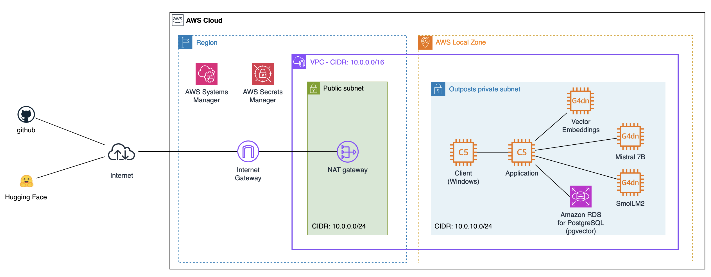

# Generative AI at the Edge

This repository provides guidance for deploying self-managed Generative AI applications running in AWS Local Zones and AWS Outposts. The code is developed to enable a choice of Small Language Models (SLM) and to compare their performance. In addition, the repo contains a sample RAG solution that allows manual upload of PDFs and a before-and-after GUI to demonstrate the difference.

All of these applications are examples and should not be deployed directly in a production environment.

## Building generative AI applications with on-premises and edge data

The repo demonstrates support for customers wishing to optimally run self-managed SLMs in constrained environments. The repo is particularly aimed at customers in regulated industries with either regulatory or personal data, or data they do not want to upload to the cloud due to data residency requirements. Additionally, some customers with data generated at the edge need to run Small Language Models (SLMs) locally for real-time processing. To address these needs, we developed these applications that demonstrate how to implement generative AI solutions while maintaining data locality and compliance requirements. 

This application was presented at [AWS re:Invent 2024 - Building generative AI applications with on-premises and edge data (HYB318)](https://www.youtube.com/watch?v=o8ih9ELuS8E)

## How does it work?

### 1. Generative AI at the Edge on AWS Outposts - Chatbot

This is a Generative AI Chatbot on the AWS Hybrid Edge that showcases a GenAI chatbot designed for organizations in regulated industries with data residency requirements. Deployed on AWS Outposts or Local Zones, the solution leverages Small Language Models (SLM) to enable real-time, context-aware interactions while keeping sensitive data within the organization’s controlled environment.

https://github.com/user-attachments/assets/24af76da-9d06-4453-80ba-793ccd81c3cc

### 2. Generative AI at the Edge on AWS Outposts - Two chatbots

To show the ability to run multiple SLMs, the GUI allows you to test two SLMs that both receive the prompt at the same time. This application showcases two Small Language Models (SLMs) running in parallel, processing the same prompt inputted by the user.

https://github.com/user-attachments/assets/425da73a-de69-4967-95fa-2653dea64b21

### 3. Generative AI at the Edge on AWS Outposts - Local Knowledgebase

This is a Local Knowledge Base application hosted on AWS edge infrastructure (AWS Outposts or Local Zones). The application allows the user to upload PDF documents, save them in an S3 bucket on Outposts, convert them to text, generate chunks, create vector embeddings, and store them in an RDS database running PostgreSQL with pgvector enabled.

https://github.com/user-attachments/assets/a428e2db-567a-4600-a8ab-69a3eb41431d

### 4. Generative AI at the Edge on AWS Outposts - Retrieval Augmented Generation (RAG)

This application demonstrates how two SLM models handle a recent question that isn't included in Mistral 7B's training data. Both models process the same question in parallel. The left model receives the question directly, while the right model uses a RAG (Retrieval-Augmented Generation) architecture to access information from a local knowledge base before responding.

https://github.com/user-attachments/assets/f830ac25-1e96-46e4-a921-95d694c1aa69

## Architecture Overview

This is the architecture to deploy the application using AWS Hybrid and Edge Services.



## How to create the environment and deploy the applications

This infrastructure can be deployed in AWS Local Zones or AWS Outposts.

### Prerequisites

1. An AWS Account
2. The Availability Zone ID of the Local Zone (e.g., us-west-2-lax-1a)
3. Name of an existing EC2 KeyPair to enable RDP access to the instance
4. An EC2 instance available for the RDS database
5. Two EC2 instances available for the Client and Application
6. Three EC2 instances G4dn.12xlarge available for the Vector embeddings and SLM foundation models
7. Hugging Face user to download the Mistral model

### 1. Creating the infrastructure in AWS Local Zones

1. Sign in to the AWS Management Console and open the CloudFormation console
2. [Create the stack](https://docs.aws.amazon.com/AWSCloudFormation/latest/UserGuide/cfn-console-create-stack.html) using  CloudFormation template

### 2. Building, installing, and configuring Llama.cpp in the Mistral and SmolLM2 EC2 instances

1. Connect to the g4dn instance using AWS SSM and execute the following commands:
```
sudo su -
mkdir /opt/slm
cd /opt/slm
git clone https://github.com/ggerganov/llama.cpp.git
cd llama.cpp
export PATH=/usr/local/cuda-12.6/bin:$PATH
cmake -B build -DGGML_CUDA=ON
cmake --build build --config Release -j48
pip install -r requirements.txt
pip install nvitop
yum install git-lfs -y
chown -R ec2-user:ec2-user /opt/slm
exit
```
2. a) For the Mistral instance: download, build, and run the Mistral model using the following commands:
```
sudo su -
su - ec2-user
mkdir /opt/slm/models
cd /opt/slm/models
git lfs install
git clone https://huggingface.co/mistralai/Mistral-7B-Instruct-v0.3
cd /opt/slm/llama.cpp
python3 convert_hf_to_gguf.py --outtype f16 --outfile /opt/slm/llama.cpp/models/Mistral-7B-instruct-v0.3-f16.gguf /opt/slm/models/Mistral-7B-Instruct-v0.3/
screen
./build/bin/llama-server -m /opt/slm/llama.cpp/models/Mistral-7B-instruct-v0.3-f16.gguf --host 0.0.0.0 -c 10240 -ngl 99 --parallel 10
<Press Control + A + D to detach from the session>
clear
```
2. b) For the SmolLM2 instance: download, build, and run the SmolLM2 model using the following commands:
```
sudo su -
su - ec2-user
mkdir /opt/slm/models
cd /opt/slm/models
git lfs install
git clone https://huggingface.co/HuggingFaceTB/SmolLM2-1.7B-Instruct
cd /opt/slm/llama.cpp
python3 convert_hf_to_gguf.py --outtype f16 --outfile /opt/slm/llama.cpp/models/SmolLM2-1.7B-Instruct-f16.gguf /opt/slm/models/SmolLM2-1.7B-Instruct/
screen
./build/bin/llama-server -m /opt/slm/llama.cpp/models/SmolLM2-1.7B-Instruct-f16.gguf --host 0.0.0.0 -c 10240 -ngl 99 --parallel 10
<Press Control + A + D to detach from the session>
clear
```

### 3. Deploying and configuring Vector embeddings application
1. Connect to the Vector embeddings instance and run the following commands:
```
sudo su -
yum install git-lfs -y
mkdir -p /opt/slm
chown -R ec2-user:ec2-user /opt/slm
su - ec2-user
mkdir /opt/slm/models
cd /opt/slm/models
git lfs install
git clone https://huggingface.co/sentence-transformers/all-MiniLM-L6-v2
mkdir /opt/slm/embeddings
cd /opt/slm/embeddings
python3 -m venv .venv
. .venv/bin/activate
# Action: Copy the src/embeddings/requirements.txt file from the repo to the /opt/slm/embeddings folder
pip install -r requirements.txt
```
2. Copy the src/embeddings/embeddings.py file to the /opt/slm/embeddings folder
3. Run the following commands to run the python application
```
screen
cd /opt/slm/embeddings/
export LD_LIBRARY_PATH=/usr/local/cuda-12.5/lib:/usr/local/cuda-12.5/extras/CUPTI/lib64:$LD_LIBRARY_PATH
python3 embeddings.py
<Press Control + A + D to detach from the session>
clear
```
### 4. Deploying and configuring the Applications
1. Connect to the application instance and run the following commands:
```
sudo su -
yum install python3-pip -y
yum install python3-devel -y
yum install libpq-devel -y
yum install gcc-c++ -y
yum install postgresql16 -y
mkdir /opt/slm/
chown -R ec2-user:ec2-user /opt/slm
su - ec2-user
cd /opt/slm
git clone <repo address>
cd <repo-name>
make
```
2. Edit the src/config.ini file and modify the following parameters values:
```
In the [DEFAULT] section  
    SLM1_endpoint = http://<private-ip-address-of-Mistral-instance>:8080/completion
    SLM1_model_name = Mistral
    SLM2_endpoint = http://<private-ip-address-of-SmolLM2-instance>:8080/completion
    SLM2_model_name = SmolLM2
In the [RDS_Connection] section  
    secret_name = <Secret name for the RDS credentials (AWS Secrets Manager)>
    region_name = <region-name>
    db_name = <RDS DB name>
    host = <RDS endpoint>
In the [VectorEmbeddings] section  
    VectorEmbeddingsURL = http://<private-ip-address-of-Vector-Embeddings-instance>:5050/get_embeddings
In the [KnowledgeBase] section  
    BucketName = <Outposts access points (only if you have an S3 bucket created in the Outposts)>
    RegionName = <region-name>
```
3. Connect to the PosgreSQL database and create vector embeddings table using the following commands:
```
psql --host=<RDS endpoint> --port=5432 --dbname=<RDS db_name> --username=postgres
Type the password
CREATE EXTENSION IF NOT EXISTS vector;
CREATE TABLE IF NOT EXISTS text_embeddings (
    id SERIAL PRIMARY KEY,
    text TEXT NOT NULL,
    embedding vector(384),
    created_at TIMESTAMP WITH TIME ZONE DEFAULT CURRENT_TIMESTAMP
);
exit;
```
4. Run the Applications using the following commands:
```
cd /opt/slm/<repo-name>
. .venv/bin/activate
cd src
screen
python3 SimpleChatbot.py
<Press Control + A + D to detach from the session>
clear

screen
python3 TwoChatbots.py
<Press Control + A + D to detach from the session>
clear

screen
python3 KnowledgeBase.py
<Press Control + A + D to detach from the session>
clear

screen
python3 RAG.py
<Press Control + A + D to detach from the session>
clear

```
### 5. Connecting to the Client instance and testing the applications

#### Testing the Generative AI at the Edge on AWS Outposts - Chatbot
1. Open the EC2 console and get the internal IP address of the Application instance
2. Connect to the Client instance using Fleet Manager Remote Desktop
3. Open the browser
4. Type `http://<private-ip-address-of-application-instance>:5010/` in the browser and press enter

#### Testing the Generative AI at the Edge on AWS Outposts - Two chatbots
1. Open the EC2 console and get the internal IP address of the Application instance
2. Connect to the Client instance using Fleet Manager Remote Desktop
3. Open the browser
4. Type `http://<private-ip-address-of-application-instance>:5020/` in the browser and press enter

#### Testing the Generative AI at the Edge on AWS Outposts - Local Knowledgebase
1. Open the EC2 console and get the internal IP address of the Application instance
2. Connect to the Client instance using Fleet Manager Remote Desktop
3. Open the browser
4. Type `http://<private-ip-address-of-application-instance>:5030/` in the browser and press enter

#### Testing the Generative AI at the Edge on AWS Outposts - Retrieval Augmented Generation (RAG)
1. Open the EC2 console and get the internal IP address of the Application instance
2. Connect to the Client instance using Fleet Manager Remote Desktop
3. Open the browser
4. Type `http://<private-ip-address-of-application-instance>:5040/` in the browser and press enter

## Cleaning up
1. Disable the Deletion protection of the RDS database and EC2 instances
2. On the CloudFormation console, [delete the Stack](https://docs.aws.amazon.com/AWSCloudFormation/latest/UserGuide/cfn-console-delete-stack.html) created in the step `1. Creating the infrastructure in AWS Local Zones`

## License

This library is licensed under the MIT-0 License. See the LICENSE file.
